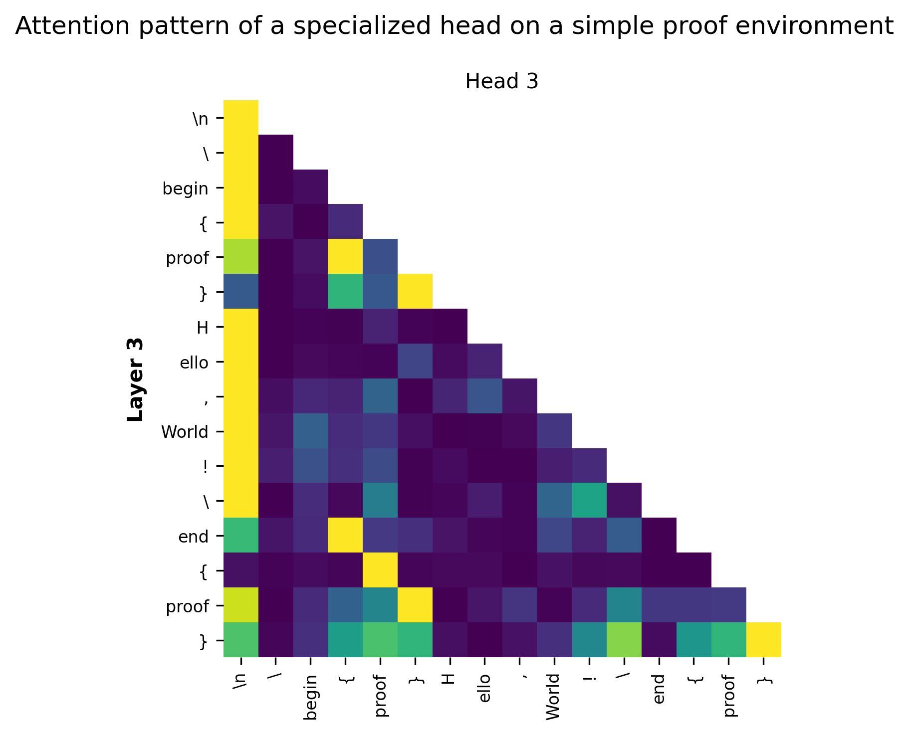
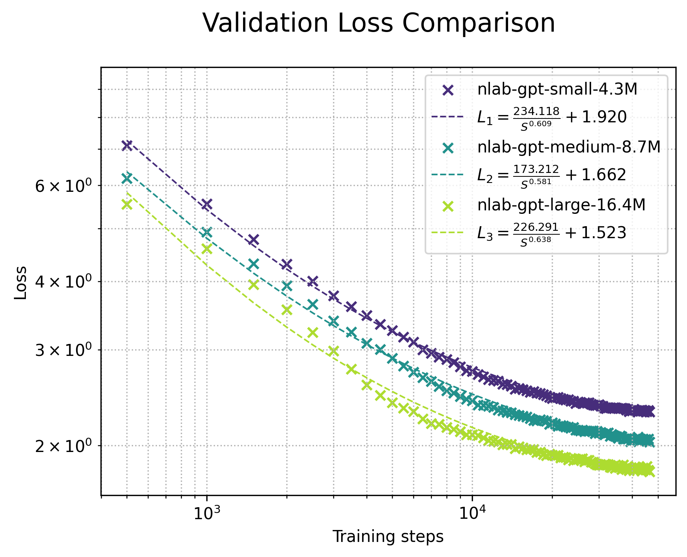
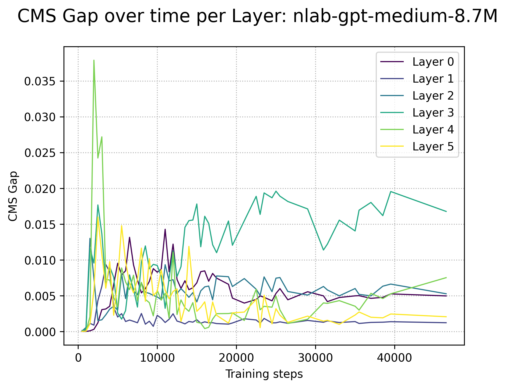
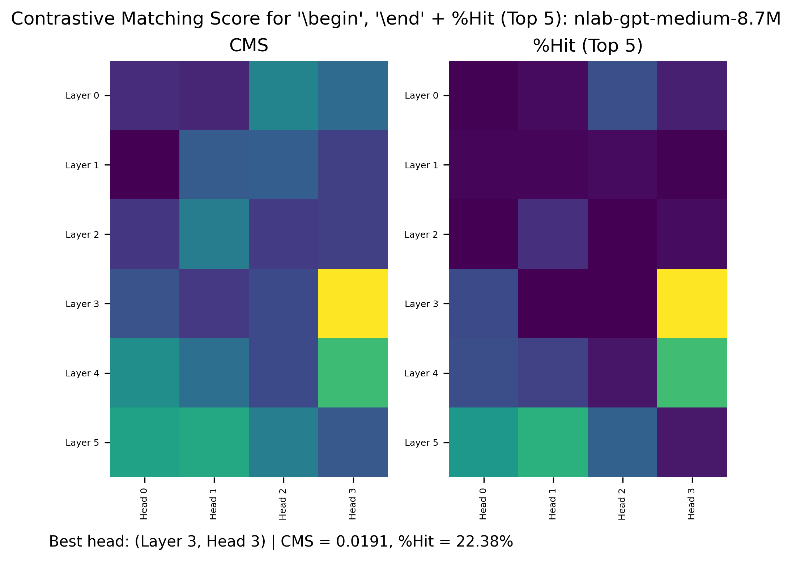
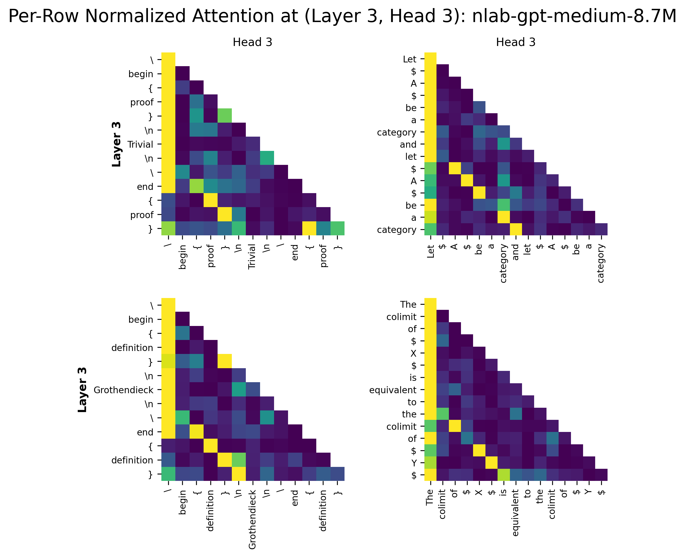

# [nLab-GPT: Emergent structure in attention heads](https://github.com/mjub/nlab-gpt)

I trained a small GPT on nLab text and showed that delimiter-matching behavior rapidly localizes to a specific attention head.

> This repository is not affiliated with the [nLab](https://ncatlab.org/nlab/show/HomePage) and its authors.

<table align="center">
  <tr>
    <td align="center" valign="middle">
      
    </td>
    <td align="center" valign="middle">
      
    </td>
  </tr>
</table>

## Overview

As a category theorist, I am of course a huge fan of the nLab, which is the _de facto_ Wikipedia for category theory. Its pages are written in a specific markup language, mixed with LaTeX commands and environments.

I built a Transformer from scratch to understand how it works and chose to feed it the entirety of the nLab (24.2M tokens). While exploring its behavior on this highly structured corpus, I noticed that some attention heads appeared to specialize early in training.

Although this project was not initially designed around a specific objective, the experiments below focus on a concrete phenomenon that emerged during exploration: whether delimiter-matching behavior localizes to specific attention heads.

For a fixed model, I measured the propensity of each head to properly match an `\end` token to its corresponding `\begin` using a _Contrastive Matching Score_. Tracking this score across training checkpoints, layers, and heads reveals that one layer, and in particular a single head, quickly stands out. A closer inspection of its attention patterns shows a clear recency-based retrieval behavior that is consistent with what is often described as an "induction-like" mechanism.

This suggests that even in a small model trained on a relatively modest amount of data (with a low _Chinchilla ratio_ of ≈2.8 tokens per parameter), structured training data can give rise to localized and interpretable attention behaviors early in training.

## Experimental setup and measurements

### Data

The nLab hosts 20,361 pages as of December 2025 (commit [`aa13ac3`](https://github.com/ncatlab/nlab-content/tree/aa13ac3a39e2e501a1444a52396e16fb329ad39c)). Pages were processed with [`data/prepare.py`](https://github.com/mjub/nlab-gpt/blob/main/data/prepare.py) to remove low-signal markup such as typographic and template engine instructions (e.g. `**bold**` or `[[!include]]`) as well as internal references. All pages were then randomly concatenated and tokenized, with a vocabulary size of 8,192 tokens.

The data were split into two sets, as follows:

| | Tokens |
| - | - |
| Training dataset | 24,202,399 |
| Validation dataset | 2,689,156 |

> **Data preparation command:** `python data/prepare.py -c {config_file}`

### Architecture

Models are decoder-only Transformers (4–16M parameters) using pre-norm blocks with RMSNorm and Grouped Query Attention, following modern LLM design choices. I only implemented basic Positional Embedding for simplicity, leaving Rotary Positional Embedding as a future possible improvement.

I trained three different models with different configurations, all of which can be inspected in the [`config/`](https://github.com/mjub/nlab-gpt/tree/main/config) folder. They are available for download on the [_Releases_](https://github.com/mjub/nlab-gpt/releases) page of this repository.

> **Training command:** `python src/train.py -c {config_file}`

| Model | Parameters | Validation loss | Configuration file |
| - | - | - | - |
| `nlab-gpt-small-4.3M` | 4,295,808 | 2.3053 | [`config/small.json`](https://github.com/mjub/nlab-gpt/blob/main/config/small.json) |
| `nlab-gpt-medium-8.7M` | 8,654,080 | 2.0324 | [`config/medium.json`](https://github.com/mjub/nlab-gpt/blob/main/config/medium.json) |
| `nlab-gpt-large-16.4M` | 16,421,760 | 1.7919 | [`config/large.json`](https://github.com/mjub/nlab-gpt/blob/main/config/large.json) |

The models were trained for 50,000 steps, saving a checkpoint only when the validation loss had strictly decreased after evaluation.

Click here to show the validation loss curves

Each validation loss curve is approximated with a power law:
$$
L = \frac{A}{S^B} + C
$$

A basic measurement of the Root Mean Square Error reveals that the validation loss decreases by ≈0.3 bits when doubling the number of trainable parameters. This fit is included purely as a sanity check and rough descriptive summary, not as a scaling claim.

### Protocol

I chose to specifically focus on `nlab-gpt-medium-8.7M` as it has the smallest number of layers (6) and heads (4 per layer) compared to the other models, making it easier and faster to analyze attention patterns.

Sequences were randomly sampled from the validation dataset, with the requirement that they contain at least two pairs of matching `\begin` and `\end`.

This criterion is necessary to compute the Contrastive Matching Score (CMS), which measures how selectively a head matches an `\end` token to its corresponding `\begin` compared to other preceding openings.

The goal of CMS is not to define a canonical metric, but to provide a simple contrastive signal that highlights delimiter-specific specialization.

Click here for more details about CMS

It is explicitly defined as the average difference between the attention score of an `\end` and its corresponding `\begin`, versus the average attention score between the same `\end` and all the other `\begin`s preceding it.

The tokenizer actually splits both `\begin` and `\end` into two tokens, namely `\`, `begin` and `\`, `end`. Manual observation of the attention scores on a small set of examples seemed to indicate that the heads would sometimes match an `end` to the corresponding `\` preceding `begin`. I crudely compensated for this by replacing the attention scores $A($`end`$, $`begin`$)$ with $\max(A($`end`$, $`begin`$), A($`end`$, $`\`$))$.

We can give a somewhat explicit formula for each layer $l$ and head $h$:

$$
\begin{align*}
\phi_{l, h}(c, o) &= \max(A_{l, h}(c, o), A_{l, h}(c, o - 1)) \\
\mathrm{CMS}(l, h) &= \mathbb{E}_i\!\left\lbrack \phi_{l, h}(c_i, o_i) - \mathbb{E}_j\!\left\lbrack\phi_{l, h}(c_i, o_j)\right\rbrack\right\rbrack
\end{align*}
$$

The variable $i$ ranges over all the pairs (`\begin`, `\end`) in the sequence, and $j$ ranges over all the `\begin` strictly before the $i$-th `\end` that are different from its corresponding ($i$-th) `\begin`.

The final CMS for each layer and head is computed as the average over several sequences.

> **Remark:** When the number of preceding `\begin` is high, the term $\mathbb{E}_j\!\left\lbrack\phi_{l, h}(c_i, o_j)\right\rbrack$ erases the mass of any specific $\phi_{l, h}(c_i, o_j)$ that would have been peaky, i.e. when a head is confident about attending the wrong opening delimiter. Future work may compare the current definition of CMS with one where $\mathbb{E}_j$ is replaced with $\max_j$ or something in between.

---

The code underpinning this protocol, as well as all the pretty plots, is available in [`notebooks/delimiter-analysis.ipynb`](https://github.com/mjub/nlab-gpt/blob/main/notebooks/delimiter-analysis.ipynb)

## Contrastive gap across layers

I computed the CMS for each layer and head of `nlab-gpt-medium-8.7M` through 55 checkpoints, at different stages of its training. For each checkpoint, I sampled 480 sequences of 512 tokens from the validation dataset, each containing at least two pairs of matching `\begin` and `\end`.

I kept the maximum CMS over all heads for each layer and subtracted the median CMS to estimate how specifically the maximum head is activated in a layer compared to the other heads. The results are plotted below:

We see that at the beginning of training, Layer 4 briefly spikes before collapsing for good. On the other hand, Layer 3 gradually increases to the point of maintaining a consistently large distance with all the other layers starting from step 15,000.

This illustrates that specialization is not monotonic across depth: while some layers exhibit transient, unstable specialization early in training (Layer 4), others (Layer 3) progressively develop and retain a structurally meaningful contrastive head, suggesting a sustained functional role rather than a training artifact.

> **Remark:** Given the small size of the validation dataset (2.7M tokens), the probability of sampling overlapping or identical sequences (i.e. a _collision_) is extremely high. Additionally, the restriction of containing at least two pairs of matching `\begin` and `\end` reduces the number of valid sequences from the validation dataset, which further increases the probability of a collision.
>
> A quick experiment with $n = 30$ batches of 480 sequences revealed that, on average, any sequence of a batch overlaps by more than 50% with at least one other sequence of the batch.

## Head-level localization of delimiter matching

The previous section showed that Layer 3 of the model is especially receptive to matching delimiters. The heatmap below represents the average CMS as well as the "hit rate" over 8,000 sampled sequences of length 512 for each individual head in each layer.

The "hit rate" is defined as the frequency at which a head consistently places the attention score between an `end` token and its corresponding `begin` (or its preceding `\`) in the top five.

We notice a clear outlier: Head 3 in Layer 3 sharply responds to delimiters, well above all other heads across all layers. Both the CMS and hit rate are peaky, firmly establishing that this is not just a diffuse layer-level effect, but the emergence of a dedicated delimiter-matching head with an interpretable mechanism, rather than incidental correlation or noise.

> **Remark:** The CMS and hit rate measure the attention score of a closing delimiter with its opening delimiter from different perspectives. It should therefore come as no surprise on the heatmap that the two are correlated.
>
> What would have been surprising is if a head had one but not the other, e.g. a peaky CMS but a flat hit rate, or the converse.

## Qualitative analysis of the specialized head

Our next and final step is to look at the behavior of Head 3 in Layer 3 on a handful of examples. I prepended every example with a dummy newline token `\n` to more explicitly distinguish true attendance from _attention sink_.

Each row corresponds to the normalized attention score of a token over all its previous tokens:

We observe a clear diagonal between matching delimiters. In the first example, the sequence `end`, `{`, `proof` attends to the sequence `{`, `proof`, `}` following the matching `begin`! In other words, the head does not directly attend to the `\begin` token itself, but to the tokens that followed it, effectively retrieving the local continuation of the previous occurrence.

One hypothesis is that the head _copies the past_: when it sees `end`, then the next token is most likely the same as the one following the previous `begin`. This is further confirmed by the other examples: we see a bright diagonal shifted by one when a sequence of tokens repeats.

This behavior is consistent with what is commonly referred to as an _induction-like mechanism_.

## Conclusion and future directions

Even at small scale, "structure" does not stay diffuse: it collapses into a tiny, inspectable circuit, one head that reliably carries delimiter-matching behavior. That does not imply full syntactic parsing, but it does give a concrete, testable mechanism for how structured text can shape model internals.

Here are a couple of things and questions I want to try next:

 - The masked self-attention mechanism is unidirectional (triangular matrix). Tokens are processed and generated from left to right. Can I hack the attention mask to enable nonlinear, e.g. tree-like generation?
 - Can we stitch together several, complementary input sources into a single output with the cross-attention mechanism?
 - Finally, training a small model on a small dataset demonstrated that Transformers are not magic wands or perfect _compressors_. I want to investigate how this connects to algorithmic information theory.
